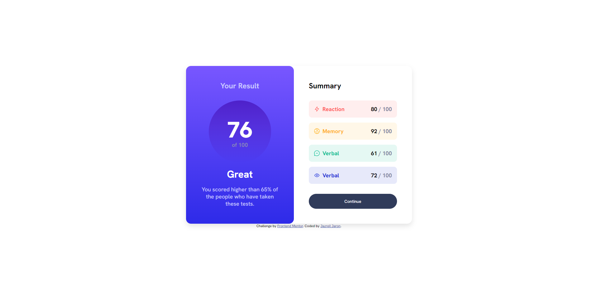
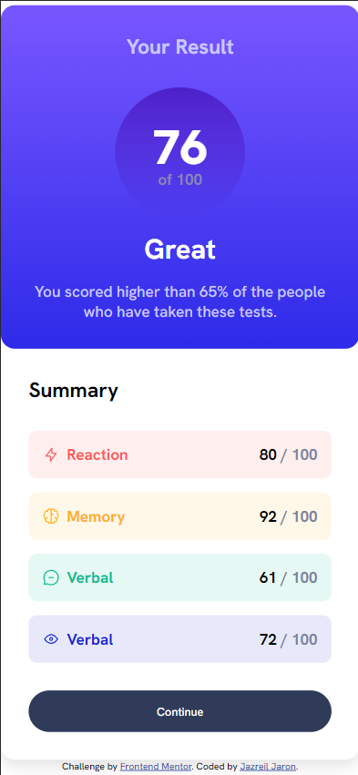

# Frontend Mentor - Results summary component solution

This is a solution to the [Results summary component challenge on Frontend Mentor](https://www.frontendmentor.io/challenges/results-summary-component-CE_K6s0maV). Frontend Mentor challenges help you improve your coding skills by building realistic projects. 

## Table of contents

- [Frontend Mentor - Results summary component solution](#frontend-mentor---results-summary-component-solution)
  - [Table of contents](#table-of-contents)
  - [Overview](#overview)
    - [The challenge](#the-challenge)
    - [Screenshot](#screenshot)
      - [Desktop View](#desktop-view)
      - [Mobile View](#mobile-view)
    - [Links](#links)
  - [My process](#my-process)
    - [Built with](#built-with)
    - [What I learned](#what-i-learned)
    - [Continued development](#continued-development)
    - [Useful resources](#useful-resources)
  - [Author](#author)

**Note: Delete this note and update the table of contents based on what sections you keep.**

## Overview

### The challenge

Users should be able to:

- View the optimal layout for the interface depending on their device's screen size
- See hover and focus states for all interactive elements on the page
- **Bonus**: Use the local JSON data to dynamically populate the content

### Screenshot
#### Desktop View


#### Mobile View



### Links

- Solution URL: [https://github.com/Atlas-jjs/results-summary]
- Live Site URL: [https://atlas-jjs.github.io/results-summary/]

## My process

### Built with

- Semantic HTML5 markup
- CSS custom properties
- Flexbox
- CSS Grid

### What I learned

- Learned more aboute HSLA.

```
color: hsla(hue, saturation, lightness, opacity);
```
- Used a div to create the circle container in the results section.

```
.score-container {
    background: var(--Circle-gradient); //linear-gradient (color, color);
    display: flex;
    flex-direction: column;
    justify-content: center;
    align-items: center;
    border-radius: 50%;
    height: 200px;
    width: 200px;
    margin-bottom: 1rem;
}
```

### Continued development

I am still not used to making "@media" that is specified for mobile devices. Hopefully, in the future I'll get the hang of it and probably start doing mobile workflow first.

### Useful resources

- [More about CSS hsla property](https://www.youtube.com/watch?v=AL6mFBeJ2wM&list=PLuW735MxtyBUR_1vjXB0DsrzFVEcewEIP&index=6&ab_channel=StephanNijman)

## Author

- Website - [Jazreil Jaron](https://www.your-site.com)
- Frontend Mentor - [@Atlas-jjs](https://www.frontendmentor.io/profile/Atlas-jjs)

